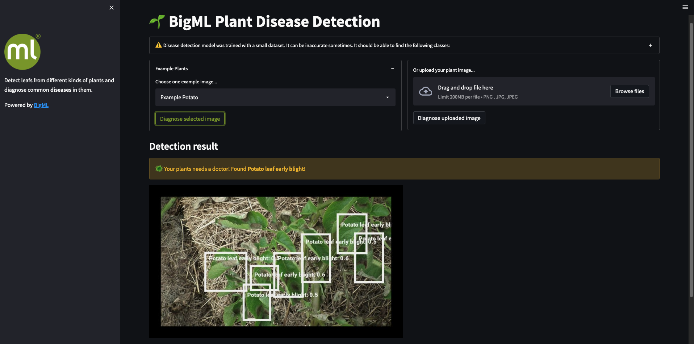

# 🌱 BigML Plant Disease Detection

Simple dashboard to detect leafs from different kinds of plants and
diagnose common diseases in them using **BigML Object Detecion**.

Environment variables `BIGML_USERNAME` and `BIGML_API_KEY` should
be defined.

Original dataset: [Plantdoc](https://arxiv.org/abs/1911.10317)
